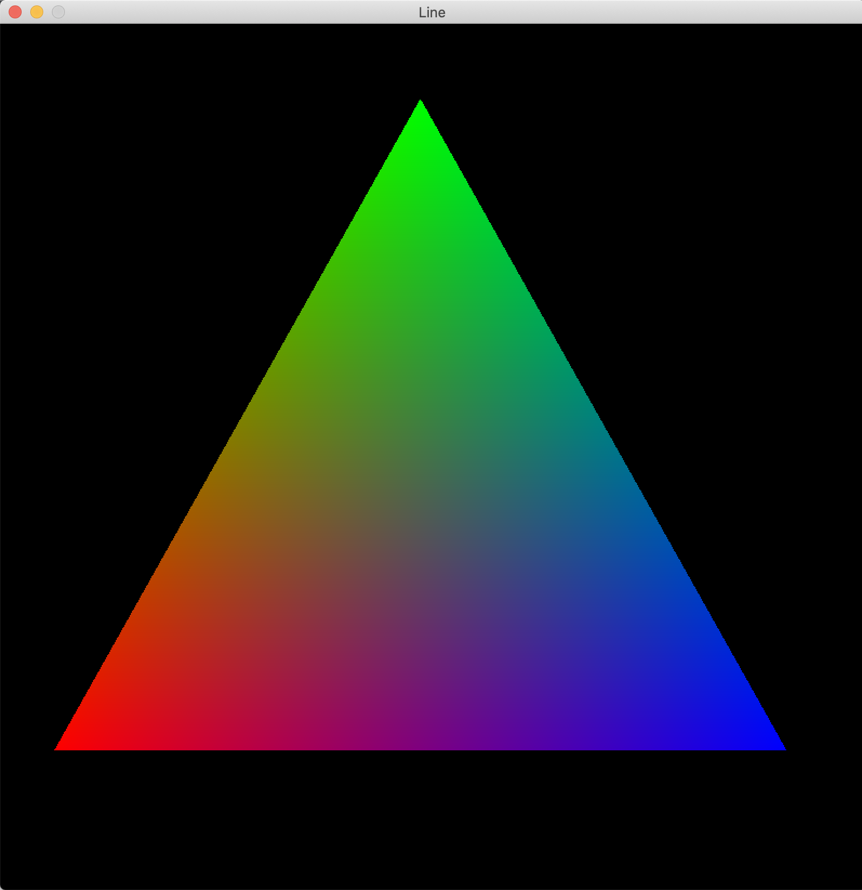
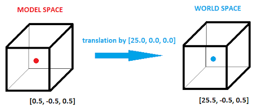

## 3D Engine Design

### I. Introduction

3D Computer Graphics have become an almost ubiquitous part of modern technology, with applications in games, architectural design, molecular and physical simulation, astronomy, 3D modeling in CAD, and many more.

However, it is important to note that with the rise of 3D computer graphics into mainstream attention, the technology has been continuously abstracted to higher and higher levels, which while important to expanding use cases to the general population, has also meant that the underlying principles–the math, the linear algebra, the rasterization principles, clipping, and the different screen spaces that have become commonalities between the multiple graphics rendering pipelines like OpenGL, DirectX, Vulkan, etc.

The goal of this project was to start from just the ability to render a pixel on a window and go through all the aforementioned techniques from scratch, ending up with a 3D software rendering pipeline I could not only use, but also understand and optimize on the lowest level possible. Also, I thought the project seemed incredibly interesting, as I saw how it could be used for procedural rendering based on data taken from the real world to create simulations for non-human actors to interact with.

---

### II. A High-level View

<video width="100%" height="100%" autoplay loop controls><source src="media/test.m4v" type="video/mp4"></video>

**Where does the Software 3D Engine start?**

Well, in this case, in order to render things in three dimensions, we must first do so in two dimensions. The two dimensional rendering system is quite intuitive, as the window itself is defined in two dimensions-it has a width and a height. One of the first things we can do is consider how we can draw a line to the screen.

Computer screens have a certain granularity to them, commonly referred to as the resolution of the screen: How many pixels wide and how many pixels tall. However, as we know from math, lines are defined by **two points**, meaning that from a mathematical perspective, they are infinitesimally thin; we should not be able to see them. We can solve that problem, however, by utilizing a technique called *rasterization*. The details will be left further down, but the basic idea can be observed here:

Essentially, we take that line and fill in the pixels that the line *intersects* with, and because the pixels are so small, we are left with a line that is disjointed when observed from very close distances, but smooth to the naked eye.

From there we can begin to draw shapes to the screen; specifically, we want to be able to render any *n-sided* polygon, and fill the contained pixels with the color of our choice. One way to do this would be to define a unique rendering function for every shape we need:
> For example, if we were rendering a rectangle/square, we could start from the top left corner of the rectangle and draw **width** many pixels across and **height** many pixels down.

However, the complexity and size of such a system would quickly balloon, leaving us unable to both understand and optimize the code efficiently. Instead, we render the most basic polygon, a triangle. and fit them into higher order polygons in order to draw any *n-sided polygon*. By doing this, we can have a single rendering pipeline that draws numerous triangles and that can be optimized for the specific algorithms that are involved. There are numerous ways that graphics pipelines use to draw triangles, but the two main ones, *Scan-line rasterization* and *Barycentric rasterization* have very different algorithms are more efficient depending on the platform being used.

#### Scan-line Rasterization

This method is inherently serial, the idea being that for each **y-coordinate** of the triangle, we calculate the left-most and right-most edge of the triangle. Then, using those bounds, we can draw a line between the two, and then move down 1 y-coordinate, hence, scan line rasterization.

This is the technique we will use because of the serial nature of the algorithm. We are running only on the CPU, and (ignoring threading), the CPU is inherently a serial computing unit.

#### Barycentric Rasterization

This technique is much more commonly used by graphics pipelines that interface with the GPU as it is an algorithm that is easily parallelized: In essence, the algorithm sets up an "edge function" E(x, y) for each of the line segments that make up the triangle that takes in a point (x, y) and returns if the point is *inside* or *outside* of the edge. (The points of triangles are usually define clock-wise or counter clock-wise so the "inside" depends on the orientation). Because these values can be calculated for individual points, a common approach is to loop over the pixels in a triangles bounding box, check if the pixel is inside of all three edge functions, and render the pixel if it is. In addition, these edge functions are linear, so they can be computed serially, but for a 3D engine that is interpolating multiple attributes (we will get to this later), it becomes more efficient (with what I've tested).

#### Vertex Interpolation

No matter what rasterization technique, you choose to use (we go with scan-line), up to this point we have been interpolating positions only. You could see the scan-line approach as interpolating between the top vertex and the bottom-left vertex to get a point on the left edge, then interpolating between the top vertex and the bottom-right vertex to get a point on the right edge, and finally interpolating *between* those two points we just found to get a point somewhere in the middle of the triangle, which we fill in with color. (Note that this holds for any orientation of triangle and Barycentric rasterization has a similar interpolation dynamic, just encoded in weights). However, what if we could interpolate more than just each vertex's position.

**What if we could, for example, interpolate color?**

In practice, we can do this by assigning a color to each vertex, and *when we interpolate the positions as seen above*, we do the same calculations for the color. By doing this, we can get smooth gradients of color across triangles defined by color "anchors" at each of the vertices.

Remarkable.

So far, however, everything we have done is in two-dimensions. Well, we shall now begin this more interesting part of our journey. It will inevitably contain more math, but seeing as this is just the high-level view, I will try to be concise and descriptive.

The first thing we need to recognize is the existence of several ***spaces*** that define the area that our vertices will transform through to eventually reach our window, or screen space. We can think of all the pre-screen space spaces as their own three dimensional coordinate system defined in a certain way so as that the intermediary transformations between such spaces map all points on one space to all points on another. Don't worry if this seems a bit esoteric for now; it will become clear with example.

#### Model/Local Space
This space is almost ubiquitous to all graphics pipelines, and its main purpose is to define the space with which we define the *meshes* for the models we want to render, hence the name. A mesh is just a fancy way of saying a combination of vertices and indices that make up the triangles of a model. The origin of this coordinate system is defined as the local origin of a model, and as such, any coordinates define in said space appear relative to that local origin.
> For example, say we were defining a cube with center (0, 0, 0). In model space, we could then say the left face of the cube would be at x = -1, and so on.

We do this for two reasons: One, using a local origin means that we can utilize that point as a sort of *anchor* or handle we can drag around, and because the other model vertices are defined relative to that local origin, they move around as well (Good for setting an object's center). Two, it means we can begin to reuse models without having to define their actual vertices where we want them to be in the world.

#### World Space
This is another common space and is where all of the objects in your "world" will be placed, relative to a *global origin*. This space encodes the position, rotation, and scale of objects from the model space, and as such, the three transformations that must occur to go between the model space and world space are the aforementioned position, rotation, and scale transformations. (We will talk specifically about these transformations further down). In essence, the world space, is a representation of the current *state* of the environment.

#### View/Camera Space
Although we will expand on this when we get to cameras, the view space is defined by the trapezoidal **frustum** cast out from the camera that represents what the viewer can actually *see*. In contrast with the world space, which has all the data about all the objects in a scene, the view space is a sort of container that allows us to determine what should or should not be rendered. More specifically, the view space should take into account the *camera's* translation and rotation in the world. This becomes incredibly important when rendering large scenes with many objects and triangles; the performance gain is immeasurable.
> Say we are rendering a city landscape. As the viewer walks through the city, objects come in and out of *view*, but they *still exist in the *world*. We can use this view space to get an idea for what objects should be culled.

#### Clip/Cull Space
It is important to note, however, that when we actually do the removal of objects in the view space is not desirable not only because it is a trapezoidal frustum, but also because we want to be able to clip using different transformations from the view space to 

---

In terms of how I started this project, although I primarily use C++, I decided to use Java for its built-in cross platform capabilities with the JVM. Additionally, it included an entire library for creating a window and rendering to it, which was incredibly helpful. Although it does not offer the same level of performance or control (Generics) as C++, it provided a suitable platform for development.
